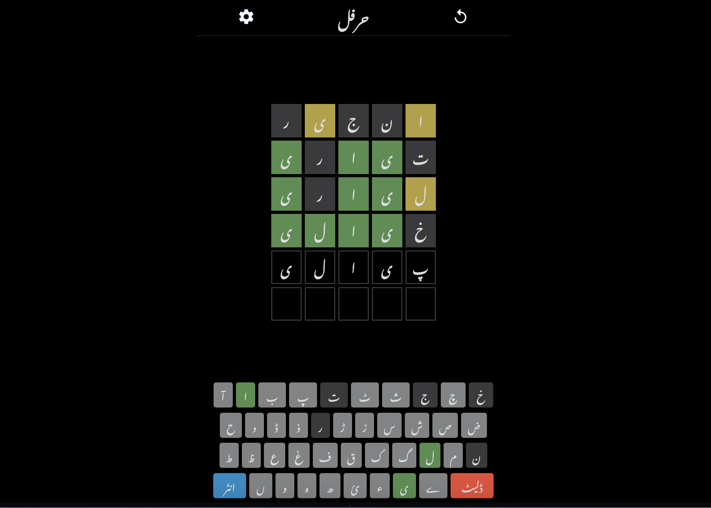

# Harfle - Wordle Clone in Urdu

Harfle is a Wordle clone developed using HTML, CSS, and JavaScript. Unlike Wordle, Harfle is specially designed for Urdu language speakers and learners. 

Play the popular word-guessing game now in Urdu!



### Check out a live demo [here](https://zayyannaveed27.github.io/harfle).


## Features

Harfle has a number of additional features that extend and adapt the original Wordle game:

- **Infinite Retries**: There's no limit to how many times you can try guessing the word. Practice makes perfect!
- **Word Length Options**: Challenge yourself with either 4-letter or 5-letter words.
- **Difficulty Levels**: Choose between easy and difficult modes to suit your language proficiency and desired challenge level.

## Getting Started

These instructions will get you a copy of the project up and running on your local machine.

### Prerequisites

- A modern web browser (Google Chrome, Firefox, Safari, etc.)

### Installation

1. Clone the repository to your local machine using git:

```bash
git clone https://github.com/zayyannaveed27/harfle.git
```

2. Open the `index.html` file in your web browser to start the game.

## Usage

After launching the game, select your preferred game settings (word length and difficulty level) and start guessing words. The game will provide feedback on your guesses to guide you toward the correct word.

## Testing

You can test the game simply by playing it! Try different game settings and guess words to your heart's content.

## Contributing

Feel free to submit pull requests or open issues to help improve Harfle.

## Authors

- Zayyan Naveed

## License

This project is licensed under the MIT License - see the [LICENSE](LICENSE) file for details.

## Acknowledgements

I'd like to express our gratitude to the creators of the original Wordle game, which inspired this Urdu version.
